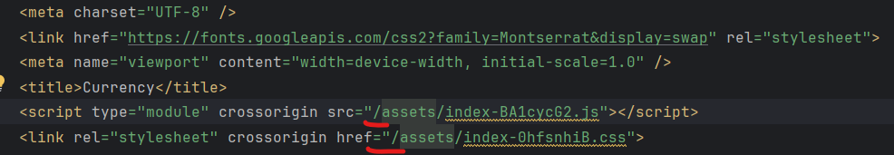

# Тестовое задание для компании NVI Solutions LLC


## Инструкция по установке и запуску

Склонируйте репозиторий и установите зависимости 

```
 git clone https://github.com/derus15/test_assignment
 npm i
```

Запуск приложения в dev режиме

```
 npm run dev
```

Сборка приложения

```
 npm run build
```

В случае сборки Vite неправильно указывает пути к файлам, удалите лишний слэш для корректной загрузки




## Инструкция по работе приложения

Для отрисовки графика выберите одну или несколько валют и нажмите "Загрузить данные".  
Чтобы загрузить курс валюты за другой период поменяйте дату и нажмите "Загрузить данные" повторно.


## Проблемы с API

Предоставленное API имеет ограниченный функционал и отображает курс валют с 2024-03-02 по наст. время. 
В случае выставления иной даты сервер возвращает ошибку 404. 

Остальные функции приложения работают корректно

